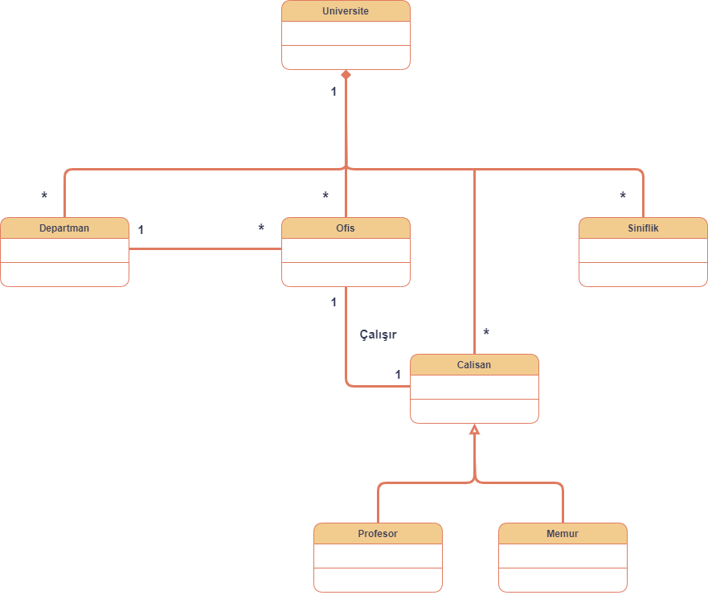

# UniversiteYonetimSistemi
Bu proje **PatikaAcademy.dev** platformunun **Başlangıç Seviyesi .Net Core Patikası** eğitimi kapsamında **Ödev - Üniversite Yönetim Sistemi** dersi için yapılmıştır. İçerisinde 1 **README**, 1 **LICENSE**, ve 1 **.png** dosyası barındırır.

**Amaç:** Aşağıdaki sistemi tasvir eden Class (Sınıf) diyagramının çizilmesi.

1. Üniversiteye ait sınıflıklar, çalışma ofisleri ve departmanlar vardır.
2. Departmanlara ait ofisler vardır.
3. Üniversiteye ait çalışanlar vardır. Bu çalışanlar profesör veya memur olabilir.
4. Her çalışan bir ofiste çalışır.

   

## LICENSE
[MIT](LICENSE)
